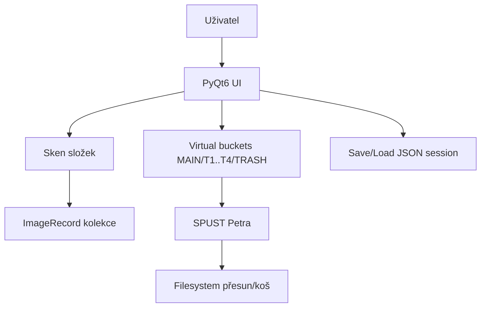

# Architecture

## Přehled modulů
- `KajovoPhotoSelector.py`: hlavní GUI aplikace, doménová logika třídění, IO operace.
- `kps_security.py`: bezpečnostní utility pro sanitizaci session dat a bezpečný cíl přesunu.
- `resources/`: statické assety.

## Data flow

## Klíčová bezpečnostní rozhodnutí
- Session load je omezen na `session_roots`; obrázky mimo roots se ignorují.
- Při fyzickém přesunu se cílové kolize řeší suffixem (`name (1).jpg`) místo přepisu.

## Diagramy
- [system-context](diagrams/system-context.mmd)
- [main-flow](diagrams/main-flow.mmd)
- [key-sequence](diagrams/key-sequence.mmd)
- [components](diagrams/components.mmd)
