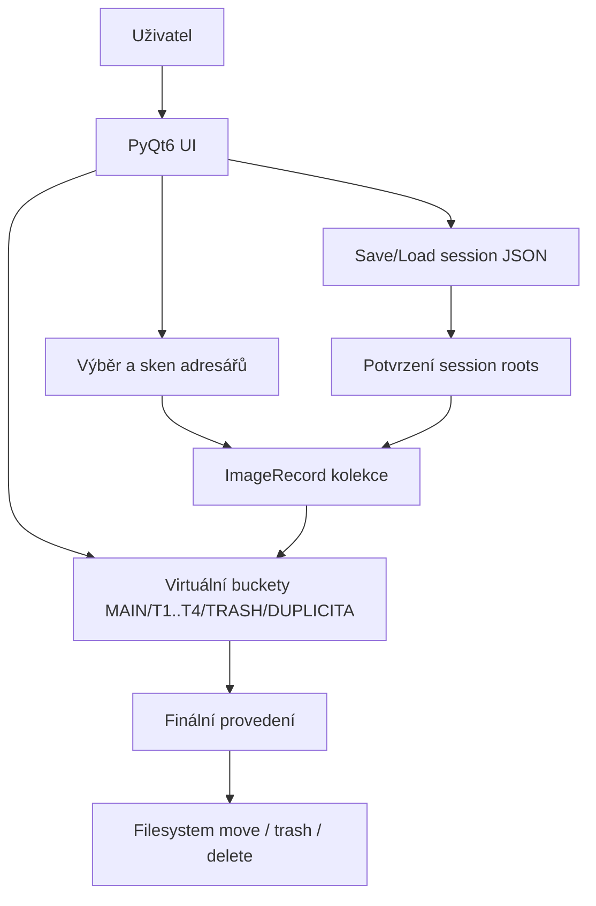

# Architecture

## Moduly
- `KajovoPhotoSelector.py`: celé PyQt6 UI, workery pro miniatury, doménová logika třídění, session save/load a finální file operations.
- `kps_security.py`: normalizace roots, kontrola scope cest, ochrana proti symlink escape a kolizím cílových souborů.
- `resources/`: runtime assety.
- `tests/`: regresní testy bezpečnosti, GUI logiky a headless E2E smoke testy.

## Hlavní tok dat

```mermaid
flowchart TD
    U["Uživatel"] --> GUI["PyQt6 UI"]
    GUI --> Scan["Výběr a sken adresářů"]
    Scan --> Records["ImageRecord kolekce"]
    GUI --> Buckets["Virtuální buckety MAIN/T1..T4/TRASH/DUPLICITA"]
    Records --> Buckets
    GUI --> Session["Save/Load session JSON"]
    Session --> Confirm["Potvrzení session roots"]
    Confirm --> Records
    Buckets --> Apply["Finální provedení"]
    Apply --> FS["Filesystem move / trash / delete"]
```

## Důležité návrhové body
- Scan je append-only nad aktuální session a deduplikuje již načtené cesty.
- Miniatury se načítají asynchronně přes `QThreadPool`; worker vrací i zdrojovou cestu, aby se ignorovaly stale výsledky po resetu nebo loadu nové session.
- Session load je dvoustupňový:
  - JSON se načte a roots se sanitizují.
  - uživatel musí potvrdit uložené zdrojové složky.
- Bucket target paths se z JSON neobnovují automaticky.
- Finální apply po cancelu nebo částečném selhání neresetuje slepě celý stav; odstraní jen úspěšně zpracované záznamy.

## Aktivní dokumentace
- [SECURITY.md](SECURITY.md)
- [TESTING.md](TESTING.md)
- diagramy v `docs/diagrams/*.mmd`
