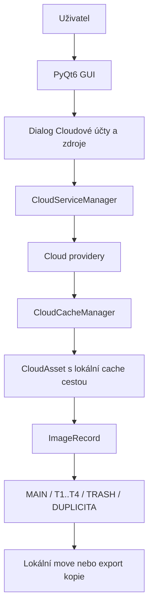

# Architektura

## Přehled modulů
- `KajovoPhotoSelector.py`: PyQt6 UI, bucket workflow, session save/load a finální lokální přesuny nebo export kopie.
- `cloud_providers/models.py`: jednotné datové modely `CloudAccount`, `CloudSource`, `CloudAsset`, `CloudScanResult` a `CloudDownloadResult`.
- `cloud_providers/base.py`: základní provider interface.
- `cloud_providers/manager.py`: orchestruje providery, účty, cache a download flow.
- `cloud_providers/cache.py`: deterministická cache mimo repozitář a manifest původu položky.
- `cloud_providers/token_store.py`: keyring a bezpečný fallback pro tokeny.
- `cloud_providers/google_drive.py`: OAuth desktop flow a Google Drive API read-only konektor.
- `cloud_providers/onedrive.py`: OAuth desktop flow přes MSAL a Microsoft Graph read-only konektor.
- `cloud_providers/google_photos.py`: Google Photos Picker pro uživatelem vybrané položky a fallback import/export režim nad exportovanými položkami.
- `cloud_providers/icloud_local.py`: iCloud Drive jako lokálně synchronizovaná složka.
- `cloud_providers/apple_photos.py`: Apple Photos / iCloud Photos jako read-only lokální knihovna na macOS.
- `cloud_providers/local_sync.py`: backward-compatible detekce synchronizovaných cloudových složek.

## Datový tok

```mermaid
flowchart TD
    U["Uživatel"] --> GUI["PyQt6 GUI"]
    GUI --> CloudDlg["Dialog Cloudové účty a zdroje"]
    CloudDlg --> Manager["CloudServiceManager"]
    Manager --> Providers["Cloud providery"]
    Providers --> Cache["CloudCacheManager"]
    Cache --> Asset["CloudAsset s lokální cache cestou"]
    Asset --> Record["ImageRecord"]
    Record --> Buckets["MAIN / T1..T4 / TRASH / DUPLICITA"]
    Buckets --> Apply["Lokální move nebo export kopie"]
```

## Důležité návrhové body
- Lokální režim zůstává zachovaný a dál používá přímé skenování adresářů.
- Cloudová vrstva je oddělená od GUI; hlavní okno už neobsahuje konkrétní API klienty.
- `CloudAsset` nese auditní metadata o provideru, účtu, zdrojové URI, revizi a lokální cache.
- Analýza duplicit vždy pracuje nad lokální cestou. Remote nebo placeholder položka se nesmí tvářit jako hotový lokální soubor.
- Pro cloudové položky aplikace při `Kájo, proveď to` nikdy nemaže vzdálený originál. Exportuje pouze lokální kopii do explicitně zvoleného cíle.

## Pravdivé režimy providerů
- `Google Drive API`: plnohodnotný read-only API konektor.
- `OneDrive API`: plnohodnotný read-only API konektor.
- `Google Photos`: oficiální Picker API pro uživatelem vybrané položky plus lokální export / Takeout režim.
- `iCloud Drive`: lokální synchronizace, ne webové API.
- `Apple Photos`: lokální read-only knihovna, ne cloudové přihlášení.

## Session vrstva
- Session JSON ukládá cloudová metadata a odkazy na cache, ale ne tokeny.
- Načtení session potvrzuje lokální roots i cloudové zdroje.
- Když účet po restartu chybí, cloudový záznam se označí jako nedostupný místo pádu.
